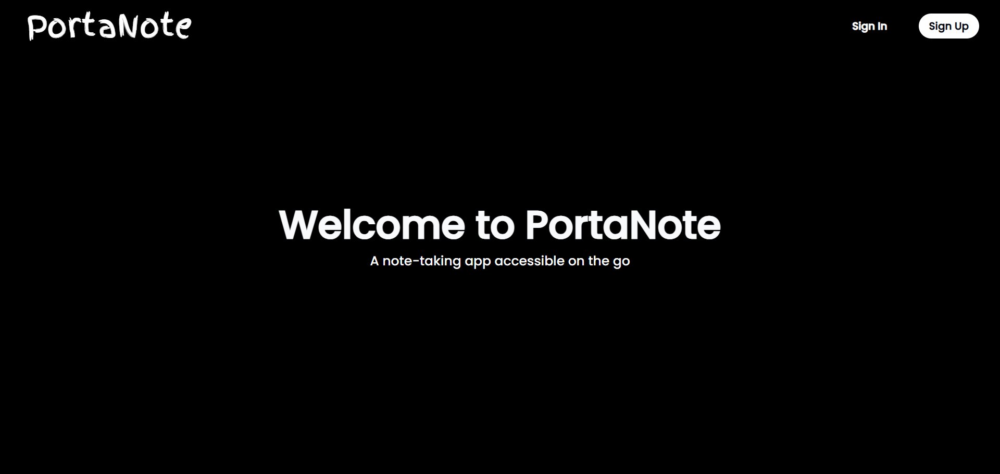
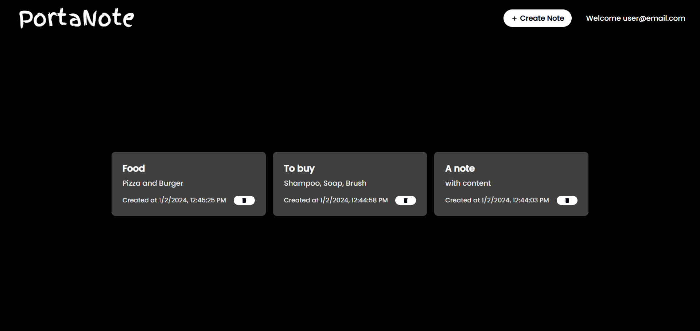
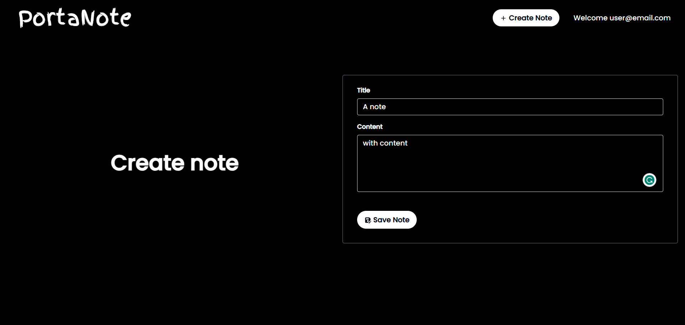

<br/>
<p align="center">
  <a href="https://github.com/SakshhamTheCoder/PortaNote-Web">
    
  </a>

  <h3 align="center">PortaNote Web</h3>

  <p align="center">
    A note-taking app accessible on the go
    <br/>
    <br/>
    <a href="https://github.com/SakshhamTheCoder/PortaNote-Web/issues">Report Bug</a>
    .
    <a href="https://github.com/SakshhamTheCoder/PortaNote-Web/issues">Request Feature</a>
  </p>
</p>

  

## Table Of Contents

-   [About the Project](#about-the-project)
-   [Built With](#built-with)
-   [Getting Started](#getting-started)
-   [Usage](#usage)
-   [Contributing](#contributing)
-   [Authors](#authors)

## About The Project

<p align="middle">
  
  
  
</p>

PortaNote is yet another note-taking app made with the help of Firebase as a backend service. This repository implements the frontend for the web app using NextJS/React.

Key Features:

-   Create unlimited notes with a title and content
-   Edit existing notes if required to change the title or content
-   Notes are sorted according to the modified time of the note
-   Delete notes if not required
-   Uses a beautiful monochromatic theme for ease of use
-   Powerful and secure authorization. Thanks to Firebase.

## Built With

-   [Firebase](https://firebase.google.com/)
-   [NextJS](https://nextjs.org/)
-   [next/font (Google Fonts)](https://fonts.google.com/)
-   [react-icons/Material Design](https://react-icons.github.io/react-icons/icons/md/s)

## Getting Started

Go to [https://portanote-web.vercel.app/](https://portanote-web.vercel.app/) to get started.

Or, to locally run the app, clone the repository. Add the `firebase.js` config file generated by Firebase to the root of `src/app/` folder. Then run the development server:

```bash
npm run dev
# or
yarn dev
# or
pnpm dev
# or
bun dev
```

Open [http://localhost:3000](http://localhost:3000) with your browser to see the result.

## Usage

Sign up or Sign in to the app using your email and password. Then, you can create notes by pressing the Create Note button above. You can view/edit your notes by pressing on one note card which opens another window where you can modify.

## Contributing

Contributions are what make the open source community such an amazing place to be learn, inspire, and create. Any contributions you make are **greatly appreciated**.

-   If you have suggestions for adding or removing projects, feel free to [open an issue](https://github.com/SakshhamTheCoder/PortaNote-Web/issues/new) to discuss it, or directly create a pull request after you edit the _README.md_ file with necessary changes.
-   Please make sure you check your spelling and grammar.
-   Create individual PR for each suggestion.
-   Please also read through the [Code Of Conduct](https://github.com/SakshhamTheCoder/PortaNote-Web/blob/main/CODE_OF_CONDUCT.md) before posting your first idea as well.

### Creating A Pull Request

1. Fork the Project
2. Create your Feature Branch (`git checkout -b feature/AmazingFeature`)
3. Commit your Changes (`git commit -m 'Add some AmazingFeature'`)
4. Push to the Branch (`git push origin feature/AmazingFeature`)
5. Open a Pull Request

## Authors

-   **Sakshham Bhagat** - [Sakshham Bhagat](https://github.com/SakshhamTheCoder)

<br/>
<h3 align="center">
Thank you
</h3>

